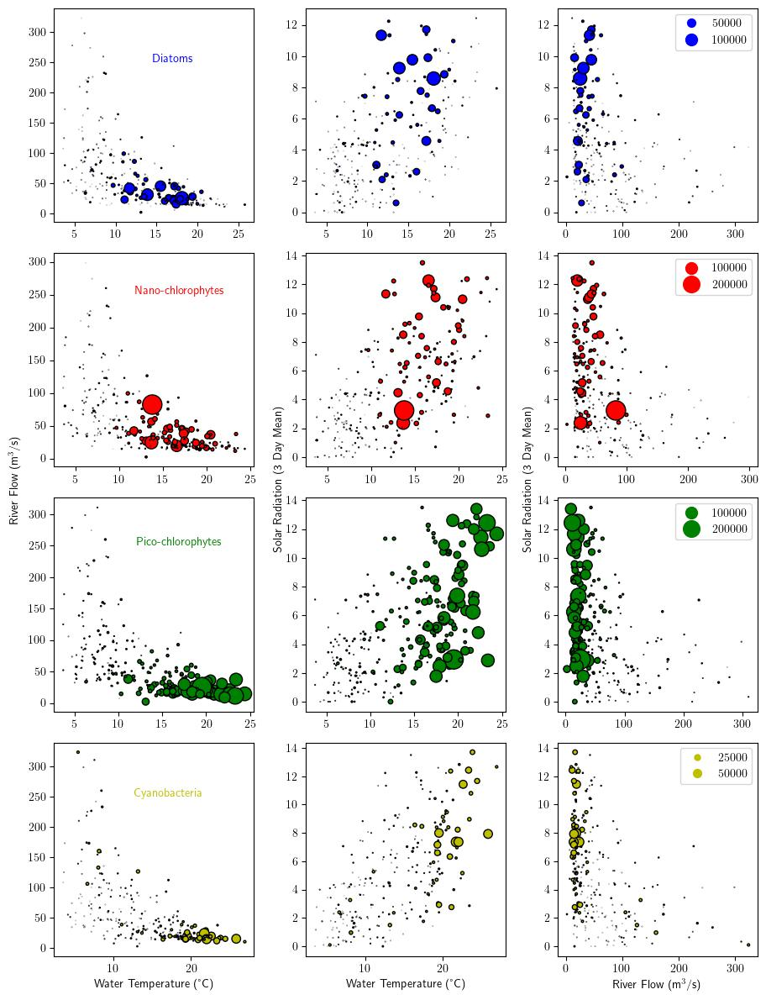
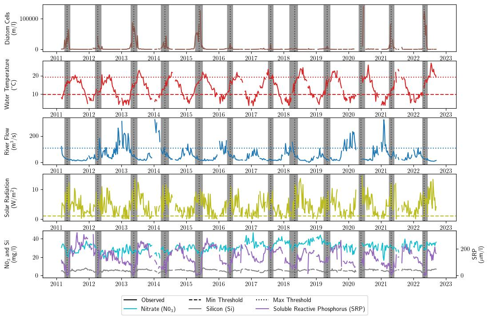
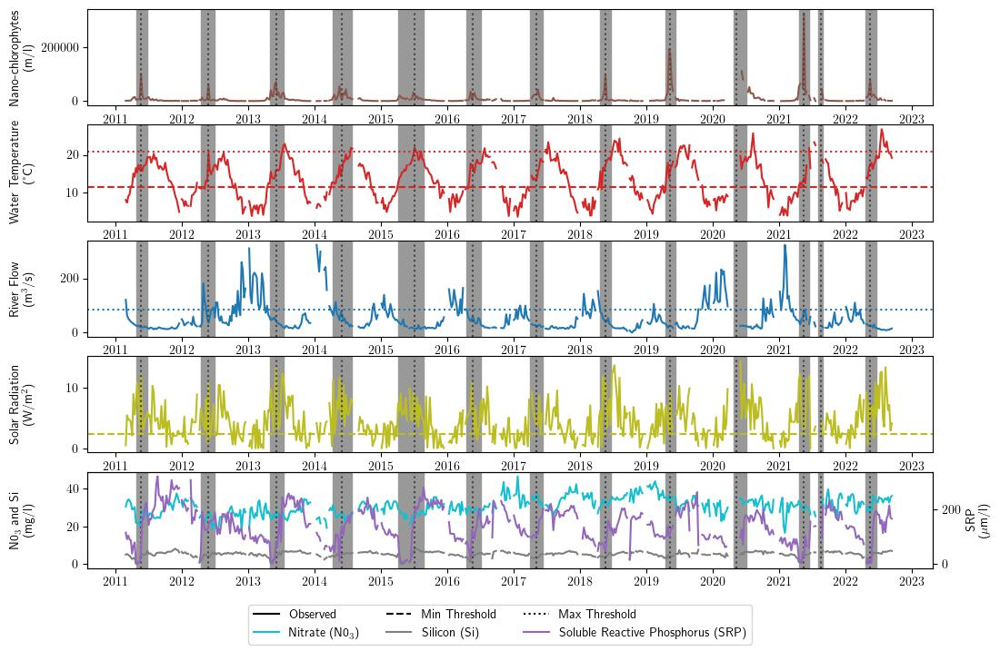
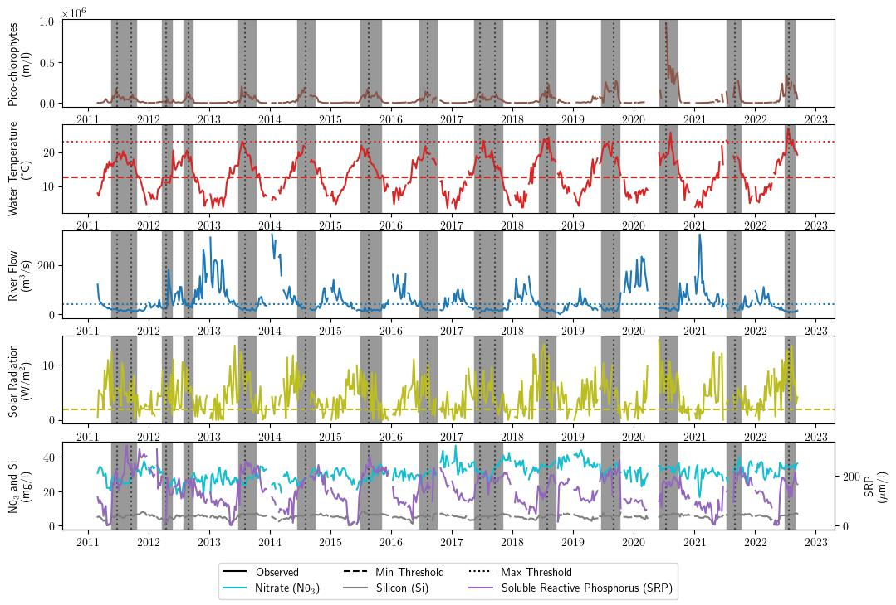
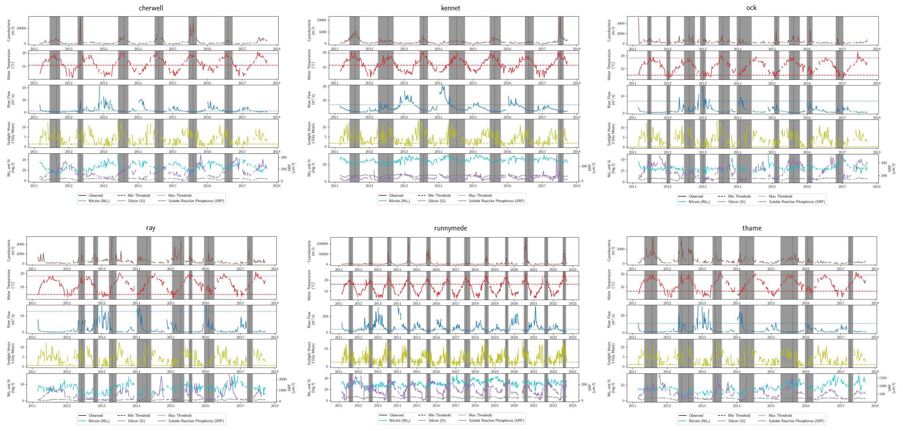
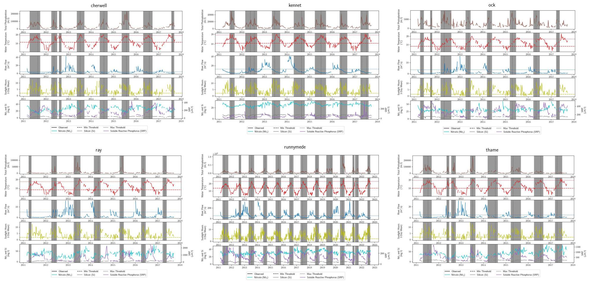
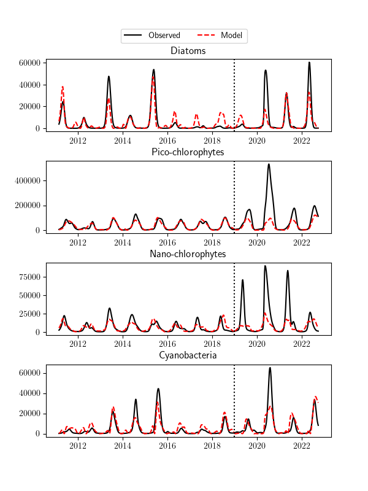

# River Thames Algae Blooms - Dissertation
## Stefan Walzer-Goldfeld

### Multi-Parameter Plot

### Time Series Plots
**Diatoms**

**Nano-Chlorophytes**

**Pico-Chlorophytes**

**Total Cyanobacteria**

**Total Phytoplankton**

### Model 

The model is given by the following equation:

$$Y_t=(\beta_6 * (\boldsymbol{\beta} \cdot \bf{V}) + \beta_7)^2 $$

where $\boldsymbol{\beta} = \\{ \beta_1, \beta_2,\beta_3, \beta_4,\beta_5 \\}$
is a vector of coefficients and $\bf{V}$ is a vector of temperature,
flow, sun, phosphorus, and silicon time series data at time $t$.

